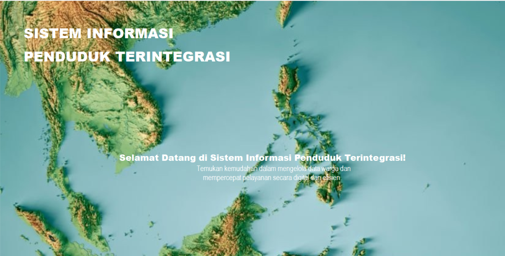
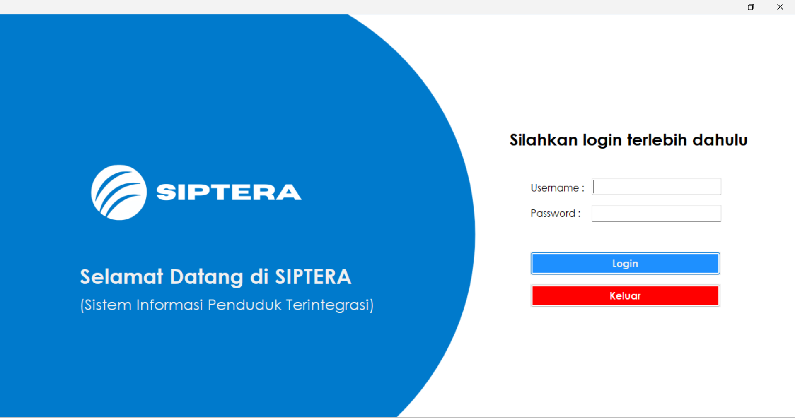
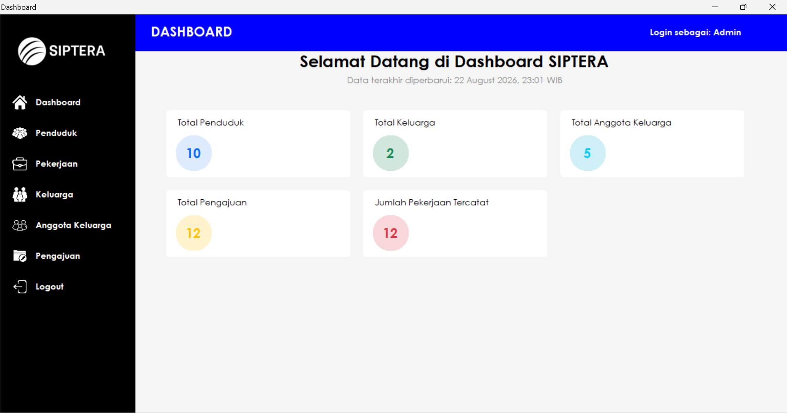
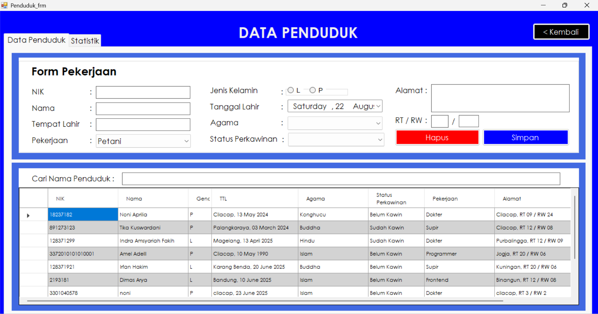
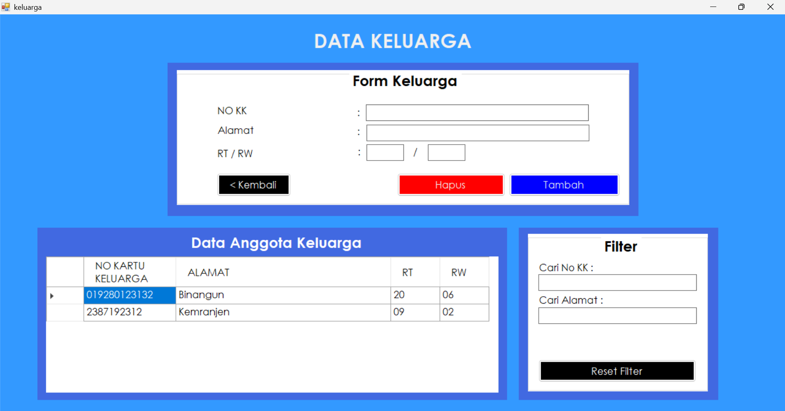
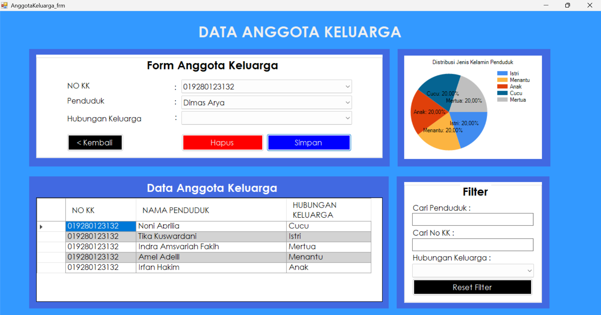
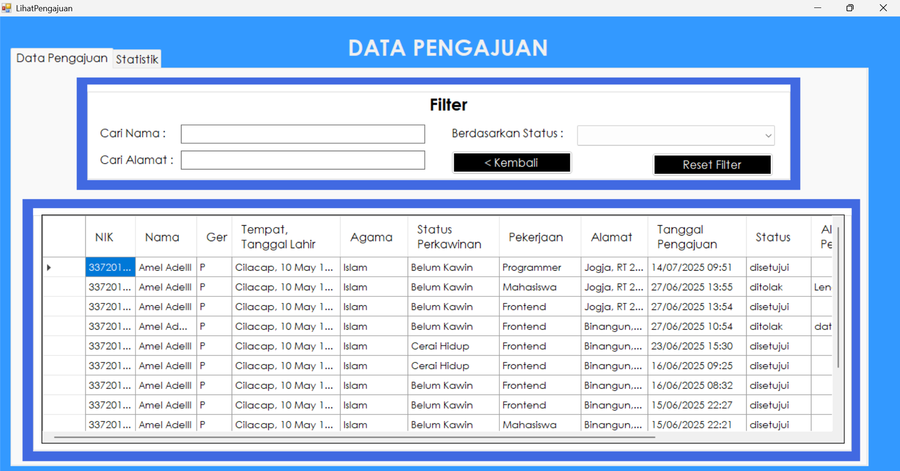

# SIPTERA - Sistem Informasi Penduduk Terintegrasi

SIPTERA (Sistem Informasi Penduduk Terintegrasi) adalah aplikasi desktop berbasis C# (.NET) yang dirancang untuk mempermudah pengelolaan data kependudukan, struktur keluarga, pekerjaan, serta pengajuan layanan warga secara digital, terpusat, dan efisien.

---

## 📌 Fitur Utama

- 🔐 **Splash Screen & Autentikasi User**: Tampilan awal aplikasi dan login sistem terproteksi untuk admin.
- 📊 **Dashboard Ringkasan Data**: Menampilkan statistik real-time terkait total penduduk, keluarga, anggota keluarga, jenis pekerjaan, dan total pengajuan.
- 👨‍👩‍👧‍👦 **Manajemen Penduduk & Anggota Keluarga**: Pengelolaan data identitas warga dan pemetaan hubungan keluarga secara terstruktur.
- 💼 **Data Pekerjaan**: Pencatatan dan klasifikasi jenis pekerjaan warga.
- 📄 **Sistem Pengajuan**: Pengelolaan dan pemrosesan riwayat pengajuan data penduduk baru.

---

## 📸 Tampilan Antarmuka Aplikasi

### 1. Halaman Splash Screen

### 2. Halaman Login

### 3. Dashboard Admin

### 4. Manajemen Data Penduduk

### 5. Manajemen Data Keluarga

### 6. Data Anggota Keluarga

### 7. Pengajuan Layanan

---

## 🛠️ Tech Stack & Tools

- **Bahasa Pemrograman**: C# (.NET Framework)
- **IDE**: Microsoft Visual Studio 2022
- **Database**: MySQL
- **Local Server**: Laragon
